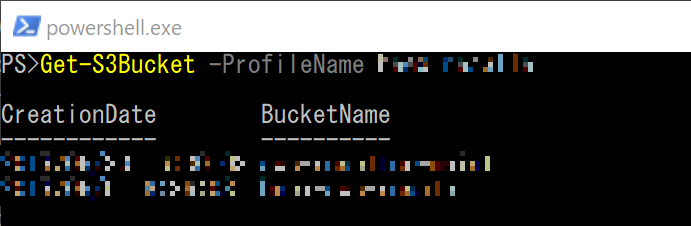
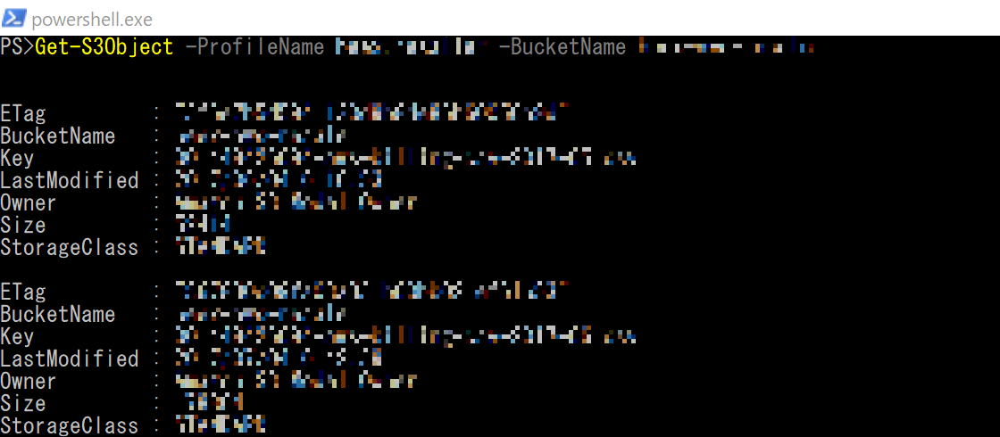
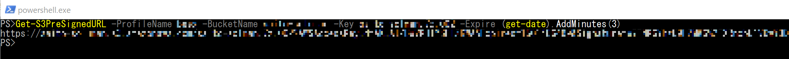
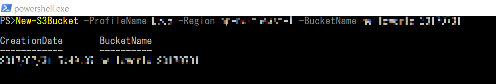
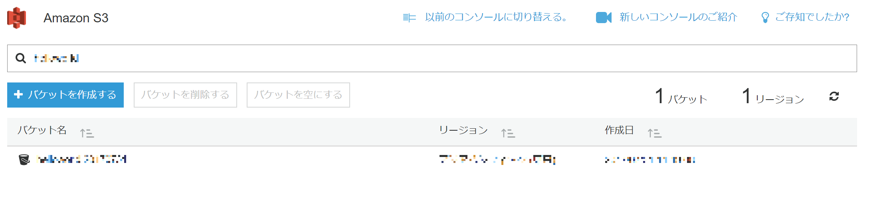
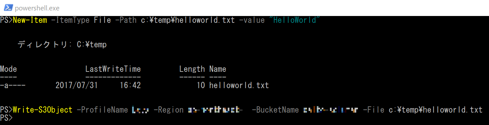
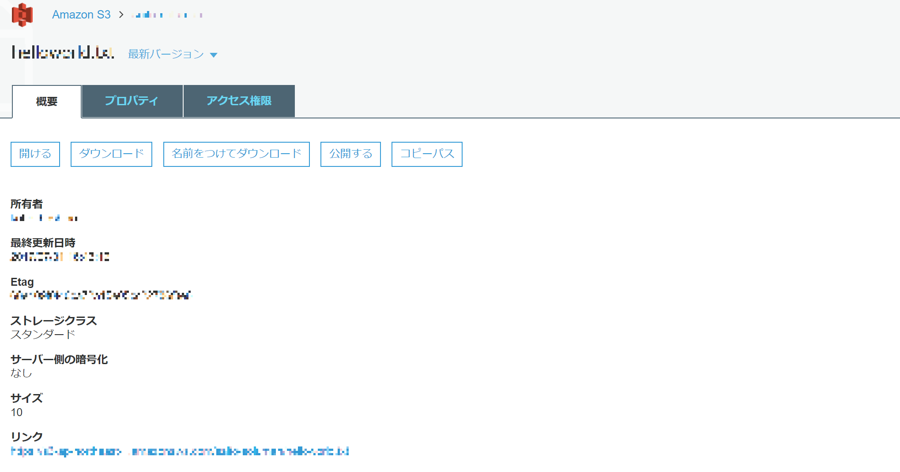
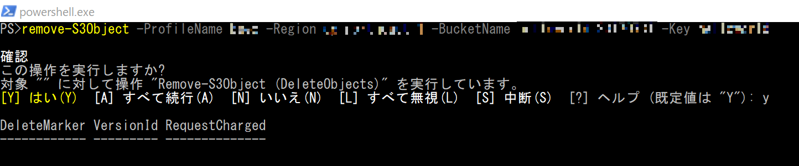
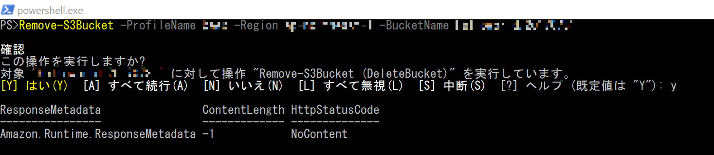

# 🔰AmazonS3をAWS Tools for Windows PowerShellから触ってみる

## 🔰AWS Tools for Windows PowerShell のドキュメント

- [AWS Tools for PowerShell Documentation](https://aws.amazon.com/jp/documentation/powershell/)
- [コマンドリファレンス](http://docs.aws.amazon.com/powershell/latest/reference/Index.html)

AWS Tools for Windows PowerShellの利用方法概要については[🔰AWS Tools for Windows PowerShellを触ってみる](https://github.com/senkousya/PS_startAWSPowerShell)を参照のこと

***

## 🔰読み込み系

### 🔰S3バケットの検索(Get-S3Bucket)

Get-S3Bucketで指定したアカウントに紐づくS3バケットの一覧を取得できる。

```Powershell
Get-S3Bucket -ProfileName **プロファイル名**
```

▶S3バケットの検索  


### 🔰S3オブジェクトの検索(Get-S3Object)

Get-S3Objectで指定したバケットのS3オブジェクトを取得できる。

```powershell
#バケットを指定してオブジェクトの検索
Get-S3Object -ProfileName **プロファイル名** -BucketName **バケット名**
```

▶S3バケットに格納されているオブジェクトの検索  


### 🔰S3オブジェクトをローカルにダウンロード(Copy-S3Object)

Copy-S3Objectでローカルにファイルのコピーを行える。

引数によって、ファイルをローカルにコピーしたり、S3にコピーしたり、ローカルのフォルダにコピーしたりできる。ここではローカルにコピーする方法を示す。

```Powershell
#ローカルファイルにコピー（ファイル名を指定してダウンロード）
Copy-S3Object -ProfileName **プロファイル名** -BucketName **バケット名 -key **キー名** -LocalFile **ファイルパス**

#ローカルフォルダにコピー（ディレクトリを指定してダウンロード。ファイル名は元のまま）
Copy-S3Object -ProfileName **プロファイル名** -BucketName **バケット名 -key **キー名** -LocalFolder **ディレクトリパス**
```

### 🔰Pre-Signed URLを生成する(Get-S3PreSignedURL)

S3のオブジェクトに期限付きurl(Pre-Signed URL)を生成する。

下記の例では3分間だけ有効なリンクを生成する。

```Powreshell
#署名付きの
Get-S3PreSignedURL -ProfileName **プロファイル名** -BucketName **バケット名** -Key **キー名** -Expire (get-date).AddMinutes(3)
```

▶Pre-SignedURLの生成  


***

## 🔰書き込み系

### 🔰S3バケットの作成(New-S3Bucket)

```Powershell
New-S3Bucket -ProfileName **プロファイル名** -Region **リージョン** -BucketName **バケット名**
```

▶S3バケットの作成  


▶作成したS3バケットの確認  


ちなみに

>The requested bucket name is not available. The bucket namespace is shared by all users of the system. Please select a different name and try again.

とか出てくる場合はメッセージ通り、バケット名がすでに利用されていて一意になっていないので他のバケット名を試して下さい。

### 🔰S3オブジェクトの書込み(Write-S3Object)

```Powershell
#アップロードテスト用にダミーファイル作成
New-Item -ItemType File -Path c:\temp\helloworld.txt -value "HelloWorld"
#作成したダミーファイルのアップロード
Write-S3Object -ProfileName **プロファイル名** -Region **リージョン** -BucketName **バケット名** -File c:\temp\helloworld.txt
```

▶ダミーファイルの作成とアップロード  


▶S3バケットの確認  


### 🔰S3オブジェクトの削除(Remove-S3Object)

```Powershell
$result = Remove-S3Object -ProfileName **プロファイル名** -Region **リージョン** -BucketName **バケット名** -Key **キー名**

$result | FT *
```

▶S3オブジェクトの削除  


### 🔰S3バケットの削除(Remove-S3Bucket)

```Powershell
Remove-S3Bucket -ProfileName **プロファイル名** -Region **リージョン** -BucketName **バケット名**
```

▶S3バケットの削除  


## 🔰総評

大量のファイルを取り扱う時は当たり前ですがCUIベースの方が便利ですね。
